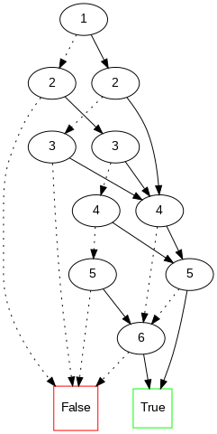

# Knowledge compilers

This repo is my Python-reimplementation of some known knowledge compilers: which may compile a clausal form (CNF) into a compiled form based on subsets of Negation Norm Form (NNF), for example d-DNNF or OBDD. The main objective is to understand the low-level implementation of these compilers and sevral basic queries.  

---

### Compilers 

#### 1. cnf2ddnnf :white_check_mark:

***Goal:*** Mimic the *c2d* program and try to reimplement it from scratch in python. A full description of *c2d* can be found at [6]. 

- [X] dtree compiler : Compile a very simple and naive dtree from clausal form
- [X] d-DNNF compiler : Compiler to d-DNNF based on a dtree 

    - [x] Decision i.e. BCP
    - [x] Unit propagation => collect all implied literals 
    - [x] Undo decide => backtrack
    - [x] Recursive DPLL
    - [x] Compute separator of dtree t
    - [x] Recursive compiler 
    - [x] Key and cache ?

In this first version, I reimplemented a very simple complier which compile from CNF to d-DNNF. This implementations is based on the work described in [1]. However, it is still a very simple version and there exists many points needed to improve. 

Some queries and transformations are implemented :

- [x] Conditionning/Literal-cojoin
- [x] SAT? 
- [ ] Entailment (based on SAT query)
- [x] Projecting
- [x] Min cardinality
- [x] Minimize (requires smooth property)
- [x] Enumerate models

Further (naive, because I am not sure about its correctness) transformations on compiled d-DNNF are:

- [x] Smooth
- [x] Simplify

***Note***: to export a png file, execute this command by declaring a dot file as input

```
dot -Tpng ./instances/my_dnnf.dot > ./instances/my_dnnf.png
```

The returned d-DNNNF (of *./instances/foo.cnf*) is shown as below:


#### 2. cnf2obdd :white_check_mark:

***Goal:*** Compile a CNF into OBDD (ordered binary decision diagram) form. This implementation is inspired by the (recursive) *Algorithm 2 & 3* described in the conference paper of J. Huang and A. Darwiche (2014s) [5].  
In which, the key point is to used a cache for storing decision nodes to save computational cost. This key can be based on either cutset or separator. More details in [5].

The returned OBDD (of *./instances/toto.cnf*) is shown as below:



#### 3. cnf2sdd :x:

My implementation is still ***in progress***.  

***Related software:***

- [**SDD Package**](http://reasoning.cs.ucla.edu/sdd/) : an open-source system for constructing, manipulating and optimizing Sentential Decision Diagrams (SDDs), implemented in C language

- [**PySDD**](https://github.com/wannesm/PySDD): a Python wrapper for interactive use of the SDD library 

---

### Analysis

- In terms of dtree compiler, I just made a very simple strategy as described in [2] without concerning about its treewidth. In order to minimize the treewidth (thus improve the performance of d-DNNF compiler), we should implement other involved versions of dtree gerenation. An interesting program for this procedure : [hmetis](http://www-users.cs.umn.edu/∼karypis/metis/hmetis/), which uses randomizes. More details on [6].

- With d-DNNF compiler, I constrained OR-node and AND-node only with 2 children. We still can extend AND-node to more than 2 children. But with OR-node, 2 children should be better because we can define the conflict-literal on this OR-node => derterministic!

- Similar to c2d, **DSHARP** ([open source](https://github.com/QuMuLab/dsharp)) also compiles a CNF to d-DNNF based on SharpSAT. More details in [7].

- OBDD compiler: I finished a recursive version as described in [5]. The iterative implementation based on DPLL procedure is still in progress. In further versions, we should consider some efficient mechanisms of modern SAT solvers such as unit propagation, non-chronological backtracking, watched literals, conflict-directed backtracking or no-good learning. A more complete version of this compiler can be found [here](http://www.disc.lab.uec.ac.jp/toda/code/cnf2obdd.html).  

Certainly, my implementation is still quite complex and dumb :) Some todo works are: 

- [ ] Reorganize main classes: dtree, dnnf, compiler, queries, transformations, etc.
- [ ] Add other mechanisms in my implemented compilers
- [ ] Add other compilers, queries and transformations
- [ ] A benchmarking test for comparing their performances? 
- [ ] Add main -> export python scripts
- [ ] Simplify code as possible :) 

---

### References

- [1] A. Darwiche, “New advances in compiling cnf to decomposable negation normal form,” Front. Artif. Intell. Appl., vol. 110, pp. 318–322, 2004. 

- [2] A. Darwiche, “Decomposable negation normal form,” J. ACM, vol. 48, no. 4, pp. 608–647, 2001, doi: 10.1145/502090.502091.

- [3] A. Darwiche, “On the tractable counting of theory models and its application to truth maintenance and belief revision,” J. Appl. Non-Classical Logics, vol. 11, no. 1–2, pp. 11–34, 2001, doi: 10.3166/jancl.11.11-34.

- [4] A. Darwiche, “A compiler for deterministic, decomposable negation normal form,” Proc. Natl. Conf. Artif. Intell., pp. 627–634, 2002.

- [5] J. Huang and A. Darwiche, “Using DPLL for efficient OBDD construction,” Proc. ofthe Seventh Int. Conf. Theory Appl. ofSatisfiability Test., 2004, doi: 10.1007/11527695_13.

- [6] A. Darwiche, “The c2d Compiler User Manual,” pp. 1–11, 2005. [Full description of c2d](http://reasoning.cs.ucla.edu/c2d/)

- [7] C. Muise, S. A. McIlraith, J. C. Beck, and E. I. Hsu, “DSHARP: Fast d-DNNF compilation with sharpSAT,” in Canadian Conference on Artificial Intelligence, 2012, doi: 10.1007/978-3-642-30353-1_36.
